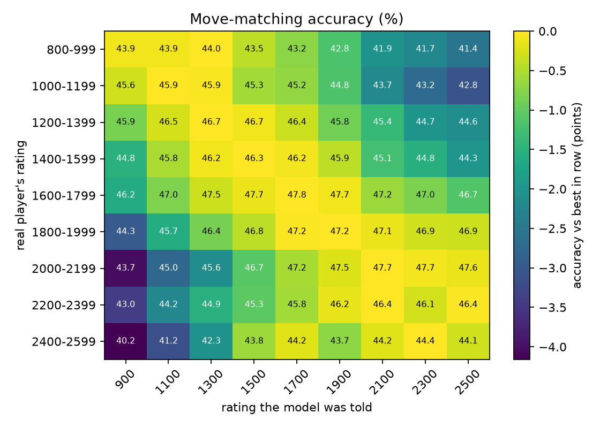
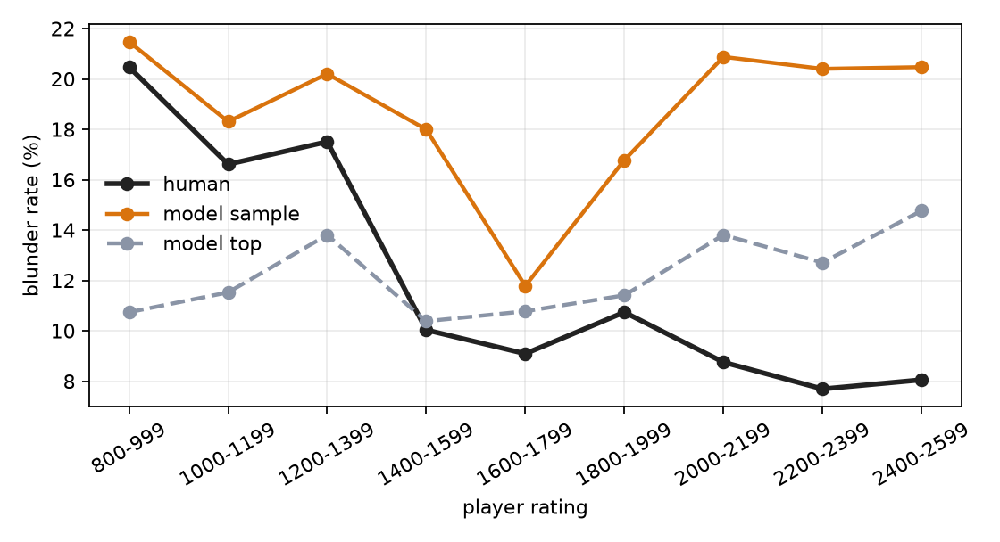

# Human chess

A chess engine that doesn't try to play the best move. It tries to play the move a
*human* would play, at any rating from 600 to 2900, mistakes included.

Tell it to play like a 1000-rated player and it hangs pieces, misses forks and
panics when its clock runs low, because that's what 1000-rated players do in the
millions of games it learned from. Tell it 2200 and the same network plays
sharp, principled chess. Nothing about blundering is programmed in; it all comes
from the data.

## How it works

**Data.** Rated blitz and rapid games from the [Lichess open database](https://database.lichess.org/)
(public domain), streamed and filtered on the fly so the multi-gigabyte monthly
files never touch the disk. Each position is stored with the move played, both
players' ratings, both clocks, the time control, how long the player thought, and
the final result. Bullet games are left out, since at that speed play is mostly
reflexes. Train and validation sets are split by game, so no game has positions
on both sides.

**Board encoding.** The board is always shown from the side to move's point of
view (mirrored when it's Black's turn), as 17 8×8 planes: one per piece type and
colour, four for castling rights and one for en passant. Positions are stored as
compact 100-byte records and turned into planes on the GPU at batch time, so
tens of millions of positions fit in memory.

**Model.** A residual CNN (8 blocks, 128 channels by default). The ratings, clocks
and time control don't enter as extra board planes: they modulate every residual
block through [FiLM](https://arxiv.org/abs/1709.07871), a per-channel scale and
shift computed from those numbers. One network can then read the same position
the way a 1000 player would, or a 2200 player with five seconds left.

It has three outputs:

- **Moves.** A probability for each of 4,168 possible moves. Each from-to pair is
  scored as a dot product between a learned vector for the from-square and one
  for the to-square, so the head stays small instead of needing a 4,096-wide
  fully connected layer.
- **Think time.** A predicted distribution over how long the player will spend,
  so the engine can take a long think in a complicated middlegame and move
  instantly when a recapture is obvious.
- **Outcome.** Win, draw or loss for the side to move, given both ratings. The
  engine uses it to resign the way a human would, instead of playing on to
  checkmate.

**Playing.** In `sample` mode the engine picks moves in proportion to how often
humans at that level play them, which is the most human setting, errors and all.
In `top` mode it always picks the single most likely human move, which plays like
a steadier version of a player at that rating. There's no search: the engine
moves on pattern recognition alone, as humans mostly do, because searching ahead
would make it play better and less like a person.

## Results

From the small CPU setup: 6 residual blocks, 64 channels, about 6 million
positions from 100,000 games, 3 epochs. Full numbers are in
[results/run/results.md](results/run/results.md).

| Player rating | Accuracy (model given true rating) | Accuracy (model always told 1500) |
|---|---|---|
| 800-999 | 43.9% | 43.5% |
| 1200-1399 | 46.8% | 46.7% |
| 1600-1799 | 47.8% | 47.7% |
| 2000-2199 | 47.7% | 46.7% |
| **All** | **46.8%** | 46.5% |

*Accuracy* is how often the model's most likely move is the exact move the human
played, on held-out games, with forced moves excluded.



The heatmap is the main experiment. Every row is a group of real players and
every column is the rating the model was told to imitate. If the conditioning
works, each row peaks near its own rating, giving a bright diagonal.

It does: low-rated players are best predicted by a low model rating and strong
players by a high one (the lowest band is nearly flat between 900 and 1300). The
effect is still small, though. Telling the model a rating 1,000 points off costs
only 1 to 3 points of accuracy, so at this size the model shifts its moves with
rating only gently. More data should sharpen it.



Stockfish checks whether the engine's mistakes look human: for each rating band
it compares how often real players blunder against how often the engine does.

Below about 1400 the model's sampled moves blunder about as often as the real
players (around 18-20% of moves). Above that, real players blunder less and less
(down to about 8%), but the model doesn't follow: in `sample` mode it stays near
20% at most ratings, because sampling occasionally picks a rare, bad move.
`top` mode stays nearer 10-15% but is too careful at low ratings. Getting strong
ratings to stop blundering is the main thing left to fix. Each band uses 300
positions, so single points can be off by 2-3 percentage points.

## Running it

```bash
pip install -r requirements.txt

python download.py --month 2025-01 --games 300000    # stream and preprocess games
python train.py --epochs 2                            # CUDA, Apple MPS or CPU, picked automatically
python evaluate.py checkpoints/run/model.pt           # accuracy, rating sweep, time pressure
python blunders.py checkpoints/run/model.pt --stockfish /path/to/stockfish
python play.py --elo 1200 --thoughts                  # play in the terminal
python gui.py                                         # play in the browser
python match.py --elo 1000 1500 2000 --sf-elo 1500    # matches against Stockfish
pytest
```

`--thoughts` prints what the engine considered ("a 1200 player here would
consider: Nf3 41%, Qh5 12%, ..."), which is the most fun way to see it work.

`gui.py` opens a board in your browser that shows the same thing on every bot
move: the moves it weighed, arrows for its top ideas, its think time and how it
rates its chances.

**Against other engines.** `match.py` plays the bot against Stockfish (or any UCI
engine with `--opponent`), alternating colours, and reports the score and a rough
performance rating for each `--elo`. Games are saved to `matches/`. Stockfish's
`--sf-elo` goes down to 1320; for weaker opposition use `--sf-skill 0` to `20`.
To watch a game live, tick "Stockfish plays for me" in `gui.py`. Its Replay tab
steps through saved match games and shows what the bot weighed on each of its moves.

**Sizing it for your machine.** Without a GPU, start small, for example
`--games 100000` and `python train.py --channels 64 --blocks 6 --epochs 1`.
Training is resumable with `--resume`.

**Play it anywhere.** `uci.py` speaks the standard UCI protocol, so the engine
works in any chess GUI, and with [lichess-bot](https://github.com/lichess-bot-devs/lichess-bot)
it can play real people on Lichess (bot accounts are allowed and clearly marked).
Set `UCI_Elo` to choose its level and `HumanTiming` to make it actually wait
before moving.

## Layout

```
hc/
  encoding.py   board and move encoding, compact position records
  data.py       PGN parsing (with clocks), dataset loading
  model.py      FiLM-conditioned residual network
  engine.py     move choice, think time, resigning
download.py     stream + filter the Lichess database
train.py, evaluate.py, blunders.py, play.py, uci.py
gui.py, gui.html  play in the browser
match.py          matches against Stockfish or other UCI engines
tests/          encoding round-trips (castling, en passant, promotions), parsing, model
```

## Prior work

The idea of a chess model that predicts human moves at a chosen rating comes from
the Maia project (McIlroy-Young et al., KDD 2020), which trained a separate
network for each rating band; their follow-up, Maia-2 (NeurIPS 2024), uses a
single network across ratings. This is my own implementation, written from
scratch. The parts I focused on that go beyond the original Maia setup: conditioning
on clock time to model time-pressure errors, a think-time head for realistic move
timing, and an outcome head for human-style resigning.

## Limitations

- It imitates average behaviour at a rating, not any particular person. A "play
  like me" model would need fine-tuning on one player's games.
- Without search it can miss simple tactics even at high ratings, in different
  ways from strong humans, who do calculate.
- Lichess ratings are not the same as FIDE ratings; "1500" here means a typical
  1500 on Lichess blitz/rapid.
